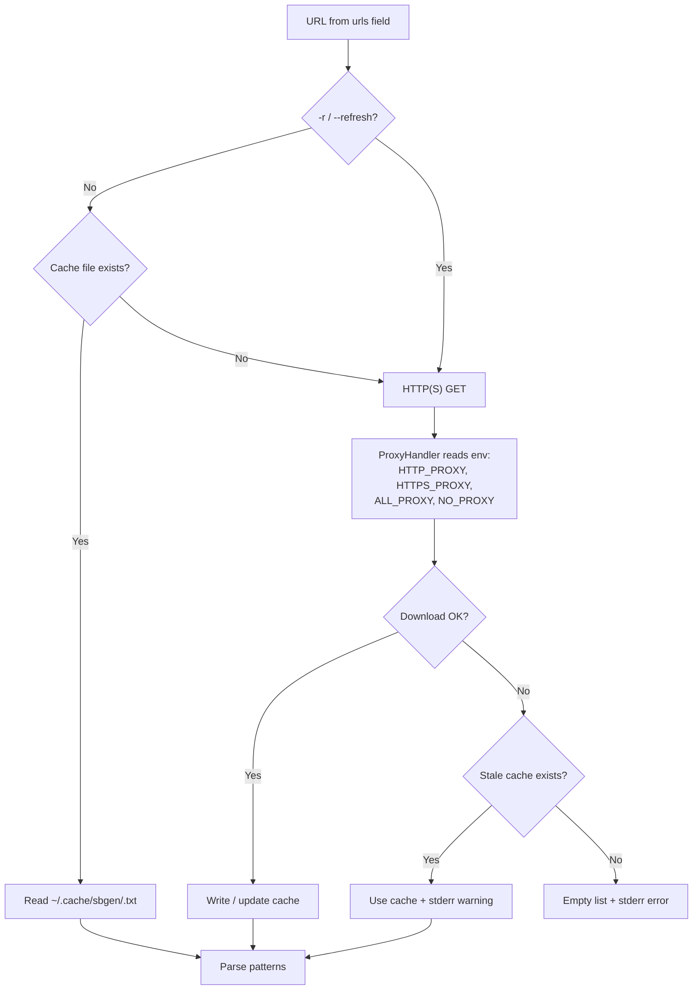
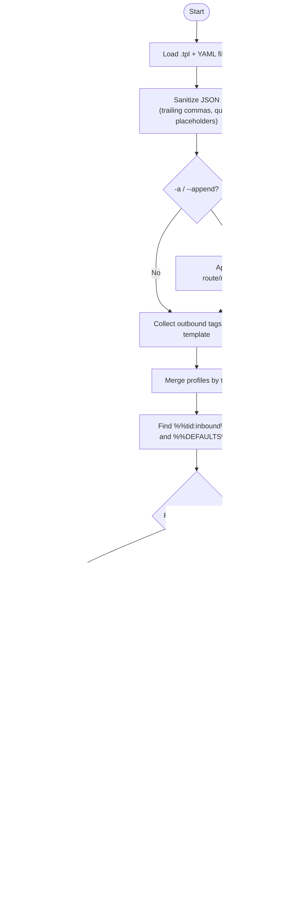

# 🧩 sbgen — sing-box configuration generator from YAML templates

**Author:** Ivan Tarasov  
**Year:** 2025  
**License:** MIT  

---

## 📘 Overview

`sbgen` is a Python utility for generating [sing-box](https://sing-box.sagernet.org/) JSON configurations from template (`.tpl`) files and YAML profiles.

It allows you to:
- define proxy routes, domain lists, and rules in YAML;
- include external domain lists (`includes`);
- combine multiple profiles (e.g., `russia.yml`, `china.yml`);
- manage priorities and fallback logic inside templates;
- ensure valid, clean JSON output with no syntax issues.

---

## ⚙️ Usage

```bash
sbgen <template.tpl> <config.yml> [more.yml...] [options]
```

**Options:**
- `-v, --verbose` — Enable debug logging to stderr
- `-b, --base-dir DIR` — Base directory for resolving relative `includes` paths (used after item/tid base dirs)
- `-c, --cache-dir DIR` — Cache directory for URL-fetched lists (default: `~/.cache/sbgen`)
- `-r, --refresh` — Force re-download of URL lists (on failure, existing cache is used)
- `-a, --append RULE` — Append raw fragment (string or JSON) into `route.rules[]` or `routing.rules[]` before placeholder processing
- `-x, --xray` — Generate Xray/V2Ray style configuration instead of sing-box

**Examples:**
```bash
# Basic usage
./sbgen nekobox-russia.tpl profiles.yml > nekobox-russia.json

# With multiple YAML files
./sbgen standalone-world.tpl profiles.yml local.yml > config.json

# Debug mode
./sbgen nekobox-russia.tpl profiles.yml -v > config.json

# Xray mode
./sbgen template.tpl config.yml -x > xray-config.json

# Append custom rule
./sbgen template.tpl config.yml -a '{"domain":["example.com"],"outbound":"proxy"}' > config.json
```

If any of the specified files do not exist, the tool exits with an error.

---

## 🧱 YAML Structure

Each YAML file defines one or more **profiles** (e.g., `russia`, `china`, `office`).

Example:

```yaml
russia:
  base_dir: ./lists
  default_direct: true
  lists:
    - name: world
      out: [ proxy, proxy2 ]
      patterns:
        - "google.com"
        - "youtube.com"
        - "linkedin.com"
      includes:
        - "world.list"
      urls: [ "https://core.telegram.org/resources/cidr.txt" ]
  direct:
    - "myserver.local"
    - includes: ["direct.list"]
  blocked:
    - includes: ["block.list"]
```

---

## 🔄 Profile Parameters

| Parameter | Type | Description |
|------------|------|-------------|
| `base_dir` | `string` | Optional. Base directory for relative `includes` paths. |
| `default_direct` | `bool` | If `true`, `%%FINAL%%` becomes `direct`. If `false`, uses first available `out` from `lists`. Default: `true`. |
| `lists` | `list<object>` | A set of routing domain groups with specific outbounds. |
| `direct` | `list<mixed>` | Directly routed domains and/or CIDR (`outbound = direct`). |
| `blocked` / `block` | `list<mixed>` | Blocked domains and/or CIDR (`outbound = block`). Both keys are supported. |

---

## ⭐ Default profile and `%%DEFAULTS%%`

Reserved profile tid: **`-`**. In YAML the key must be quoted:

```yaml
"-":
  base_dir: ./lists
  lists:
    - name: world
      out: [ proxy ]
      includes: [ world.list ]
  direct:
    - includes: [ direct.list ]
  blocked:
    - includes: [ block.list ]
```

The **`%%DEFAULTS%%`** placeholder expands rules from profile `-` **without** binding to an inbound (`inbound` / `inboundTag` omitted). Use it for list-based routing that applies to all interfaces.

In a template:

```json
{
  "route": {
    "rules": [
      %%DEFAULTS%%,
      %%russia:in-tun%%
    ],
    "final": "%%FINAL%%"
  }
}
```

Regular `%%tid:inbound%%` (or `%%tid:in1,in2#d6%%`) placeholders generate rules with an `inbound` field.

---

### 🔹 Elements of `lists`

Each `lists` item may contain:

| Field | Type | Description |
|--------|------|-------------|
| `name` | `string` | Optional descriptive name. |
| `out` | `string or list<string>` | One or more outbounds to route traffic to. |
| `patterns` | `list<string>` | Inline domain patterns and/or CIDR entries (IPv4/IPv6 with prefix). |
| `includes` | `list<string>` | Paths to external lists (one domain per line, `#` for comments). |
| `urls` | `list<string>` | URLs of lists in the same format as `includes`; fetched over HTTP(S) with caching (default: `~/.cache/sbgen`; `-c`/`--cache-dir`, `-r`/`--refresh`; on fetch error the existing cache is used). HTTP(S) proxy via `HTTP_PROXY` / `HTTPS_PROXY` env vars (see [URL Fetching and Proxy](#-url-fetching-and-proxy)). |
| `direct6` | `bool` | If `true` and the placeholder has an inbound with `#d6`, emit `resolve` (`prefer_ipv6`) and `::/0` → `direct` on those inbounds before the list rules; IPv6 CIDRs from the list go only to inbounds **without** `#d6`. Sing-box only (ignored with `-x`). |
| `resolve6` | `string` | DNS server tag for `action: resolve` when `direct6` is set (e.g. `dns-v6`). |

---

## 🔀 Multiple inbounds and `#d6`

The `%%tid:…%%` placeholder accepts one or more inbounds, comma-separated. After an inbound name, `#` introduces flags:

```text
%%russia:in-russia-split,in-russia-split4#d6%%
```

- Multiple inbounds → `"inbound": ["in-russia-split", "in-russia-split4"]` (a single inbound stays a string).
- `#d6` on an inbound: for a list with `direct6: true`, that inbound gets resolve + all IPv6 to `direct`; the list's IPv6 CIDRs are routed only on inbounds without `#d6`.

Example list:

```yaml
- name: world
  out: [ out-world, proxy ]
  direct6: true
  resolve6: dns-v6
  includes: [ world.list ]
  urls: [ "https://core.telegram.org/resources/cidr.txt" ]
```

Rule order for such a list: preamble (`resolve` + `::/0`) → IPv4 CIDR → IPv6 CIDR (non-`#d6`) → domains.

---

## 🧩 Supported Domain Patterns

| Example | Interpreted As | Generated Rule |
|----------|----------------|----------------|
| `example.com` | `domain_suffix` | `"domain_suffix": ["example.com"]` |
| `.example.com` | `domain_suffix` | `"domain_suffix": ["example.com"]` |
| `*.example.com` | `domain_suffix` | `"domain_suffix": ["example.com"]` |
| `rutracker.*` | `domain_regex` | `"domain_regex": ["^(.+\\.)?rutracker\\.[^.]+$"]` |
| `cdn.*.example.com` | `domain_regex` | `"domain_regex": ["^cdn\\.[^.]+\\.example\\.com$"]` |
| `*cdn.com` | `domain_regex` | `"domain_regex": ["^[^.]*cdn\\.com$"]` |
| `localhost` | `domain_suffix` | `"domain_suffix": ["localhost"]` |

**CIDR.** Lines in CIDR format (IPv4 or IPv6 with prefix) are recognized and emitted in **separate** rules:

| Example | Interpreted As | Generated Rule |
|----------|----------------|----------------|
| `192.168.0.0/16` | IP (CIDR) rule | `"ip_cidr": ["192.168.0.0/16"]` |
| `10.0.0.0/8`, `fd00::/8` | IP (CIDR) rule | `"ip_cidr": ["10.0.0.0/8", "fd00::/8"]` |

In Xray mode (`-x`), CIDR uses the `ip` field instead of `ip_cidr`.

**Note:** In Xray mode (`-x`), domain fields become `domainSuffix` and `domainRegex` instead.

---

## 📂 `includes` and `urls` content format

Files from `includes` and content fetched from `urls` share the same format. Example `world.list`:

```text
# streaming
youtube.com
netflix.com
*.hulu.com

# social
twitter.com
facebook.com
```

- Each line defines a domain or pattern. A line can also be a CIDR (e.g. `192.168.0.0/16`, `fd00::/8`); such entries are emitted as rules with `ip_cidr` (sing-box) or `ip` (Xray).  
- `#` starts a comment (full line or inline with `\#` to escape).  
- Empty lines are ignored.  
- Inline comments are supported: `example.com # comment`  
- Paths are resolved relative to (in priority order):
  1. Directory of the YAML file from which the item was loaded
  2. Profile's `base_dir` (from YAML)
  3. CLI `--base-dir` option
  4. Current working directory

---

## 🌐 URL Fetching and Proxy

Lists from the `urls` field are downloaded over HTTP(S). Requests use a `ProxyHandler` that reads standard environment variables (uppercase and lowercase names are both supported):

| Variable | Purpose |
|----------|---------|
| `HTTP_PROXY` / `http_proxy` | Proxy for HTTP URLs |
| `HTTPS_PROXY` / `https_proxy` | Proxy for HTTPS URLs |
| `ALL_PROXY` / `all_proxy` | Fallback proxy for any scheme |
| `NO_PROXY` / `no_proxy` | Comma-separated hosts that bypass the proxy |

**Example:**

```bash
export HTTPS_PROXY=http://127.0.0.1:7890
export HTTP_PROXY=http://127.0.0.1:7890
./sbgen template.tpl profiles.yml -v > config.json
```

With `-v`, configured proxies are printed to stderr (credentials in proxy URLs are redacted).

**Note:** Built-in `urllib` proxy support covers HTTP/HTTPS proxies. SOCKS URLs in environment variables may require an HTTP front-end (e.g. from sing-box/clash) or extra dependencies.

### URL fetch flow



---

## 🧠 sbgen Logic



1. Loads the `.tpl` template and all YAML files.  
2. Sanitizes JSON (removes trailing commas, quotes unquoted placeholders).  
3. Merges all top-level keys (`tid`), e.g., `russia`, `china`, `-`.  
4. Collects available outbound tags from the template.  
5. Finds placeholders like `%%russia:in-tun%%`, `%%DEFAULTS%%`, or `"%%FINAL%%"` in the template.  
6. For each placeholder:
   - Loads patterns from `lists`, `direct`, and `blocked` sections
   - Resolves `includes` files (relative to `base_dir`, item base, or CLI `-b`)
   - Fetches `urls` lists (see [URL Fetching and Proxy](#-url-fetching-and-proxy))
   - Splits patterns into domain (`domain_suffix`/`domain_regex`) and CIDR; CIDR entries produce separate rules with `ip_cidr` (or `ip` in Xray)
   - For `%%tid:inbound%%` / `%%tid:in1,in2#d6%%`, generates rules bound to that inbound (array when multiple; `#d6` + `direct6`/`resolve6` for the IPv6-direct branch); for `%%DEFAULTS%%`, uses profile `-` with no inbound
7. Replaces placeholders with generated rule arrays.  
8. Computes `%%FINAL%%` based on `default_direct` and available outbounds.  
9. Outputs valid JSON to stdout.  

---

## 🧩 Example 1 — Standalone Server

**Template (`server.tpl`):**
```json
{
  "route": {
    "rules": [
      %%russia:in-tun%%
    ],
    "final": "%%FINAL%%"
  }
}
```

**YAML (`russia.yml`):**
```yaml
russia:
  lists:
    - out: proxy
      patterns: [ "youtube.com", "twitter.com" ]
  direct: [ "intranet.local" ]
```

**Result:**
```json
{
  "route": {
    "rules": [
      { "inbound": "in-tun", "outbound": "proxy", "domain_suffix": ["twitter.com", "youtube.com"] },
      { "inbound": "in-tun", "outbound": "direct", "domain_suffix": ["intranet.local"] }
    ],
    "final": "direct"
  }
}
```

---

## 🌐 Example 2 — NekoBox (TUN Mode)

**Template (`nekobox.tpl`):**
```json
{
  "inbounds": [
    {
      "tag": "in-tun",
      "type": "tun",
      "endpoint_independent_nat": true,
      "inet4_address": ["172.19.0.1/28"],
      "mtu": 9000,
      "sniff": true,
      "stack": "mixed"
    }
  ],
  "route": {
    "rules": [ %%russia:in-tun%% ],
    "final": "%%FINAL%%"
  }
}
```

---

## 🌐 Example 3 — Standalone V2Ray/Xray

**Template (`v2ray.tpl`):**
```json
{
  "log": { "level": "warn" },
  "inbounds": [
    {
      "tag": "in-socks",
      "port": 1080,
      "protocol": "socks",
      "settings": {
        "auth": "noauth"
      }
    }
  ],
  "outbounds": [
    { "tag": "proxy", "protocol": "vmess", ... },
    { "tag": "direct", "protocol": "freedom" },
    { "tag": "block", "protocol": "blackhole" }
  ],
  "routing": {
    "rules": [
      %%myprofile:in-socks%%
    ],
    "domainStrategy": "IPIfNonMatch"
  }
}
```

**Generate Xray/V2Ray configuration:**
```bash
./sbgen v2ray.tpl config.yml -x > v2ray-config.json
```

**Note:** In Xray mode (`-x`):
- Use `routing` instead of `route`
- Use `routing.rules[]` instead of `route.rules[]`
- Field names use camelCase: `outboundTag`, `domainSuffix`, `domainRegex`, `inboundTag`
- `%%FINAL%%` is replaced with the selected outbound tag (e.g., `"direct"` or `"proxy"`) and can be used in `routing.final` or anywhere in the template

---

## ⭐ Example 4 — `%%DEFAULTS%%` (rules without inbound binding)

Shared `direct`/`blocked` (and optionally `lists`) live in profile `-` and expand via `%%DEFAULTS%%` — with no `inbound` field.

**YAML (`profiles.yml`):**
```yaml
"-":
  base_dir: ./lists
  direct:
    - includes: [ direct.list ]
  blocked:
    - includes: [ block.list ]

russia:
  lists:
    - out: proxy
      patterns: [ "youtube.com" ]
```

**Template:**
```json
{
  "outbounds": [
    { "tag": "proxy", "type": "direct" },
    { "tag": "direct", "type": "direct" }
  ],
  "route": {
    "rules": [
      %%DEFAULTS%%,
      %%russia:in-tun%%
    ],
    "final": "%%FINAL%%"
  }
}
```

**Result (excerpt):**
```json
{
  "route": {
    "rules": [
      { "outbound": "direct", "domain_suffix": ["intranet.local"] },
      { "action": "reject", "domain_suffix": ["ads.example"] },
      { "inbound": "in-tun", "outbound": "proxy", "domain_suffix": ["youtube.com"] }
    ],
    "final": "direct"
  }
}
```

Rules from `%%DEFAULTS%%` apply to all interfaces; `%%russia:in-tun%%` only to `in-tun`.

---

## 🔀 Example 5 — Multiple inbounds and split IPv6 handling (`#d6` / `direct6`)

Two mixed inbounds: full dual-stack and “IPv4-proxy only” (`#d6`), where IPv6 goes `direct` for lists with `direct6: true`.

**YAML:**
```yaml
russia:
  lists:
    - name: israel
      out: [ out-isl ]
      patterns: [ "myip.com" ]
    - name: world
      out: [ out-world ]
      direct6: true
      resolve6: dns-v6
      patterns:
        - "2ip.io"
        - "91.108.56.0/22"
        - "2001:b28:f23d::/48"
```

**Template:**
```json
{
  "inbounds": [
    { "tag": "in-russia-split",  "type": "mixed", "listen": "0.0.0.0", "listen_port": 11001 },
    { "tag": "in-russia-split4", "type": "mixed", "listen": "0.0.0.0", "listen_port": 11005 }
  ],
  "outbounds": [
    { "tag": "out-isl", "type": "direct" },
    { "tag": "out-world", "type": "direct" },
    { "tag": "direct", "type": "direct" }
  ],
  "route": {
    "rules": [
      { "inbound": "in-russia-split",  "action": "sniff" },
      { "inbound": "in-russia-split4", "action": "sniff" },
      %%russia:in-russia-split,in-russia-split4#d6%%
    ],
    "final": "direct"
  }
}
```

**Result (`route.rules` excerpt):**
```json
[
  { "inbound": "in-russia-split",  "action": "sniff" },
  { "inbound": "in-russia-split4", "action": "sniff" },

  { "inbound": ["in-russia-split", "in-russia-split4"], "outbound": "out-isl", "domain_suffix": ["myip.com"] },

  { "inbound": "in-russia-split4", "server": "dns-v6", "strategy": "prefer_ipv6", "action": "resolve" },
  { "inbound": "in-russia-split4", "ip_cidr": ["::/0"], "action": "route", "outbound": "direct" },

  { "inbound": ["in-russia-split", "in-russia-split4"], "outbound": "out-world", "ip_cidr": ["91.108.56.0/22"] },
  { "inbound": "in-russia-split", "outbound": "out-world", "ip_cidr": ["2001:b28:f23d::/48"] },
  { "inbound": ["in-russia-split", "in-russia-split4"], "outbound": "out-world", "domain_suffix": ["2ip.io"] }
]
```

On `in-russia-split4`, IPv6 for list `world` goes `direct`; IPv6 CIDRs are proxied only via `in-russia-split`.

---

## 🌍 Example 6 — Multiple YAML Profiles

```bash
./sbgen standalone-world.tpl profiles.yml > config.json
```

- Placeholders `%%russia:in-tun%%` and `%%world:in-tun%%` will both be resolved if present in template.  
- YAML files are merged by their top-level identifiers (`tid`).  
- If the same `tid` appears in multiple files, their sections are merged (lists, direct, blocked are combined).

---

## 🔧 Example 7 — Using `-a` (--append) Option

The `-a` option allows you to inject custom rules into `route.rules[]` (or `routing.rules[]` in Xray mode) **before** placeholder processing. This is useful for adding priority rules or rules that don't fit the YAML structure.

### Example 7.1 — Append a Single Rule (String Placeholder)

Append a placeholder that will be processed later:

```bash
./sbgen nekobox-russia.tpl profiles.yml -a '%%russia:in-extra%%' > config.json
```

This adds `%%russia:in-extra%%` to the rules array, which will be replaced during placeholder processing if it exists in the template context.

### Example 7.2 — Append a Single Rule (JSON Object)

Add a custom rule directly:

```bash
./sbgen standalone-russia.tpl profiles.yml \
  -a '{"domain":["example.com","test.com"],"outbound":"direct"}' \
  > config.json
```

**Result:** The rule is appended to the end of `route.rules[]`. If placeholders are processed, they are replaced in place, so the order depends on where placeholders are located in the template.

---

## 📁 Project Structure Example

```
.
├── sbgen                    # Python script
├── profiles.yml            # YAML configuration with multiple profiles
├── nekobox-russia.tpl      # Template for NekoBox (mobile)
├── standalone-russia.tpl   # Template for standalone (desktop)
├── lists/                  # Domain lists directory
│   ├── world.list          # International services
│   ├── russia.list         # Russian services
│   ├── israel.list         # Israeli services
│   ├── direct.list         # Direct connection domains
│   └── block.list          # Blocked domains
└── README.md
```

**Typical workflow:**
```bash
# Generate NekoBox config
./sbgen nekobox-template.tpl config.yml > nekobox-config.json

# Generate standalone config
./sbgen standalone-template.tpl config.yml > standalone-config.json
```

---

## 📱 NekoBox Workflow Example

This section shows how to modify an existing NekoBox configuration using `sbgen`.

**Note:** By default, NekoBox uses:
- Inbound tag: `tun-in`
- Outbound tag: `proxy`

When creating templates or using placeholders, use these default names (e.g., `%%myprofile:tun-in%%`).

**Example YAML configuration (`config.yml`):**

```yaml
myprofile:
  base_dir: ./lists
  default_direct: true
  lists:
    - name: world
      out: [ proxy ]
      includes: [ world.list ]
      urls: [ "https://core.telegram.org/resources/cidr.txt" ]
      patterns:
        - "google.com"
        - "youtube.com"
  direct:
    - includes: [ direct.list ]
  block:
    - includes: [ block.list ]
```

This configuration will generate rules for the `%%myprofile:tun-in%%` placeholder, routing domains from `world.list` through the `proxy` outbound.

### Step 1: Export Configuration from NekoBox

1. Open NekoBox app
2. Select your server configuration
3. Tap the **Share** icon (📤)
4. Choose **Configuration** → **Export as file**
5. Save the exported JSON file (e.g., `exported-config.json`)

### Step 2: Process the Configuration

You have two options to add routing rules:

#### Option A: Create a Template

1. **Extract the base configuration:**
   - Copy the exported JSON
   - Remove or replace the `route.rules[]` section with placeholders
   - Save as a template (e.g., `custom-template.tpl`)

   **Example template:**
   ```json
   {
     "log": { "level": "warn" },
     "dns": { ... },
     "inbounds": [ ... ],
     "outbounds": [ ... ],
     "route": {
       "rules": [
         %%myprofile:tun-in%%,
         { "inbound": ["tun-in"], "outbound": "proxy" }
       ],
       "final": "%%FINAL%%"
     }
   }
   ```

2. **Generate new configuration:**
   ```bash
   ./sbgen custom-template.tpl config.yml > updated-config.json
   ```

#### Option B: Use `-a` to Append Rules

Add rules directly to the exported configuration. You can pass placeholders or JSON rules via `-a`:

```bash
# Add a placeholder that will be processed
./sbgen exported-config.json config.yml \
  -a '%%myprofile:tun-in%%' \
  > updated-config.json

# Or add a JSON rule directly
./sbgen exported-config.json config.yml \
  -a '{"domain_suffix":["example.com"],"outbound":"direct"}' \
  > updated-config.json
```

**Note:** When using `-a` with an exported config, the script will:
- Process any placeholders in the file (if present)
- Process placeholders passed via `-a` (if any)
- Add your custom rule to `route.rules[]`
- Preserve all other settings (DNS, inbounds, outbounds, etc.)

### Step 3: Import Back to NekoBox

1. Open NekoBox app
2. Tap the **Add** icon (+)
3. Select **Manual Settings** → **Custom Config**
4. Choose **Import from file** or paste the JSON content
5. Select the generated file (e.g., `updated-config.json`)
6. Save and activate the configuration

### Complete Example

```bash
# 1. Export from NekoBox → exported-config.json

# 2. Process with sbgen (using -a option with placeholder)
./sbgen exported-config.json config.yml \
  -a '%%myprofile:tun-in%%' \
  > updated-config.json

# 3. Import updated-config.json back to NekoBox
```

**Tip:** Use `-v` flag to see what rules are being added:
```bash
./sbgen exported-config.json config.yml -a '...' -v > updated-config.json
```

---

## 🧩 Debugging

To enable debug mode:
```bash
./sbgen template.tpl config.yml -v
```

This prints to stderr:
- Template and YAML file paths
- Proxy settings from environment (credentials redacted)
- Base directories for each profile
- Available outbound tags
- Found placeholders
- Pattern loading from includes and URLs (cache vs network)
- Generated rules count
- FINAL outbound selection

---

## ⚠️ Common Issues

| Error | Cause | Solution |
|--------|--------|----------|
| `Template not found` | Template file doesn't exist | Check file path |
| `JSON error: ...` | Invalid JSON syntax | Check for unclosed brackets, quotes, or invalid placeholders |
| `Include not found: ...` | `includes` file path cannot be resolved | Check `base_dir` or use absolute paths |
| `Skip list out='...' (not present in template outbounds)` | Outbound tag in YAML doesn't exist in template | Verify outbound tags match between template and YAML |

**Note:** The script automatically handles trailing commas in JSON templates, but other JSON syntax errors must be fixed manually.

---

## 📜 License

MIT © Ivan Tarasov, 2025  
Free to use, modify, and distribute with author attribution.